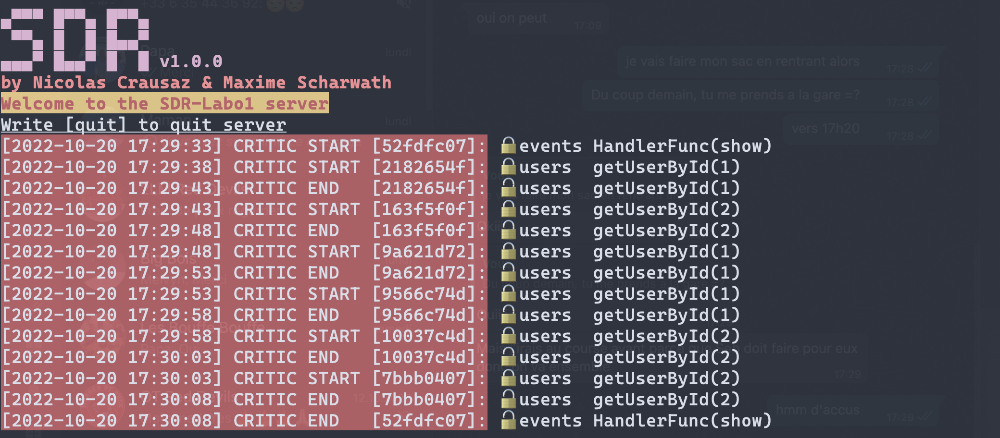

# SDR 2022 / Labo 2 - Programmation répartie

> Nicolas Crausaz & Maxime Scharwath


## Configuration

La configuration des serveurs et du client sont séparées dans deux fichiers différents.

La configuration des serveurs se trouve dans [`server.json`](./server.json):

```json
  "servers": [
    {
      "client": "localhost:10000", // Port pour la connexion client du serveur id 0
      "server": "localhost:11000" // Port pour la connexion inter-serveur du serveur id 0
    },
    {
      "client": "localhost:10001", // Port pour la connexion client du serveur id 1
      "server": "localhost:11001" // Port pour la connexion inter-serveur du serveur id 1
    }
  ]
  "debug": false,         // Mode de debug de la concurence, ralenti les entrées en section critique
  "showInfosLogs": false, // Active l'affichage des données brutes lors des communications et du status de Lamport
  "users": [...],         // Utilisateurs enregistrés
  "events": [...]         // Evénements enregistrés
```

La configuration du client se trouve dans [`client.json`](./client.json):

```json
{
   "servers": [ // Liste des serveurs
      "localhost:10000", // Adresse du serveur id 0
      "localhost:10001"  // Adresse du serveur id 1
   ],
   "showInfosLogs": false // Active l'affichage des données brutes lors des communications
}
```

## Utilisation

> **Attention**
> Pour une utilisabilité optimale, il est recommandé d'utiliser un terminal qui supporte les couleurs et les emojis.
> Fonctionne sur Windows Terminal, terminal de MacOS et Linux.

### Démarrer les serveurs

> `go run server.go --id 0` \
> `go run server.go --id 1` \
> `go run server.go --id 2`

Les serveurs attendront des connexions sur leur port TCP configuré dans `server.json` et attendront d'être tous interconnectés avant d'accepter les connexions clients.

### Lancer un client (directement, ou via un exécutable)

> `go run client.go`

Le client se demandera sur quel serveur se connecter (il faut entrer l'adresse complète du serveur, par exemple `localhost:10000`).
Sinon, en appuyant simplement sur entrée, il se connectera par défaut à un serveur aléatoire.

### Liste de commandes disponible

#### Créer une manifestation

> create

Puis saisir les informations demandées. Il est nécessaire de s'authentifier pour créer une manifestation.

#### Clôturer une manifestation

> close

Puis saisir les informations demandées.
Il est nécessaire de s'authentifier et d'être le créateur de la manifestation pour la clôturer.

#### Inscription d’un bénévole

> register

Puis saisir les informations demandées. Il est nécessaire de s'authentifier.
Il est possible d'être inscrit qu'à un seul poste par manifestation, l'inscription la plus récente sera conservée.

#### Liste des manifestations

> show

Affiche l'état de toutes les manifestations.


#### Informations d'une manifestation

> show `<numéro manifesation>`

Affiche les informations d'une manifestation


#### Répartition des postes pour une manifestation

> show `<numéro manifesation>` --resume

Affiche l'état des postes d'une manifestation.


## Protocole de communication

Le protocole de communication est basé sur le protocole TCP. Les messages sont sérialisés en JSON.

1. Le client envoie une chaîne de caractères au serveur appelée `Endpoint` qui indique la fonctionnalité à appeler.
2. Le serveur va répondre avec un message de type `Header` qui indique si le `Endpoint` existe et si l'utilisateur doit
   être authentifié.
3. Si la requête nécessite une authentification, le client envoie un message de type `Credentials` avec les identifiants
   de l'utilisateur.
4. Si l'authentification est réussie, le serveur envoie un message de type `AuthResponse` qui indique si les
   identifiants sont valides.
5. Le client envoie n'importe quel type de message qui correspond à la fonctionnalité demandée.
6. Le serveur envoie un message de type `Response` qui indique si la requête a été traitée avec succès ou non et
   contient le résultat de la requête.

Les données sont envoyées sur le réseau sous forme de chaînes de caractères finissant par un caractère de fin de
ligne `\n`.

Nous utilisons des structures de type DTO (Data Transfer Object) pour sérialiser les données afin de faciliter la
lecture et l'écriture des messages.

### Lamport

L'exclusion mutuelle est garantie par l'algorithme de Lamport.

> **Attention**
> Lamport est utilisé uniquement lors de demande d'écriture, la commande show se base sur les données reçues lors de la dernière
> synchronisation (donc supposée à jour). Cette commande n'utilise donc pas le mécanisme de lamport, mais utilise quand meme une
> SC interne (serveur).

## Tests

### Intégration

> **Attention**
> Les tests vont créer des serveurs et des clients qui vont communiquer entre eux.
> Il est donc nécessaire de s'assurer que les ports définis dans les configurations soient disponibles.

Pour exécuter les tests, lancez la commande :

> `go test ./tests/integration_test.go`

### Concurrence

Pour effectuer des tests manuels sur la concurrence et sur le protocole, modifiez la configuration du serveur pour
ralentir les entrées en zones critiques :

> `"debug": true`

Il suffit ensuite de démarrer les serveurs et plusieurs clients (voir marche à suivre ci-dessus).

En exécutant des commandes depuis les clients, on peut observer les entrées / sorties en sections critiques sur le
serveur :




### Scénarios de tests

Pour les scénarios de tests suivants, connectez les trois serveurs (`--id 0`, `1` et `2`) et le nombre souhaité de clients aux serveurs souhaités.
Il est également recommandé d'activer le debug et l'affichage des informations dans les fichiers de configuration.
Par exemple :

> `go run server.go --id 0` \
> `go run server.go --id 1` \
> `go run server.go --id 2`

Puis 

> `go run client` \
   > -> localhost:10000 \
> `go run client` \
   > -> localhost:10001 \
> `go run client` \
   > -> localhost:10002

Ces scénarios ont pour but de tester la bonne réplication des données. Et observer l'état de Lamport.

#### Création d'évènement

Client 1 connecté au serveur 1 : créer un événement

À durant la création, on obtient successivement les états :

> Servers		Server 0	Server 1	Server 2 \
> T:1 SC:false	REQ(1)		REL(0)		REL(0) \
> T:3 SC:false	REQ(1)		ACK(2)		REL(0) \
> T:4 SC:false	REQ(1)		ACK(2)		ACK(2) \
> T:5 SC:true	REL(5)		ACK(2)		ACK(2)

Client 2 connecté au serveur 2 : créer un événement

À durant la création, on obtient successivement les états :

> Servers		Server 0	Server 1	Server 2 \
> T:7 SC:false	REL(5)		REQ(7)		REL(0) \
> T:9 SC:false	ACK(8)		REQ(7)		REL(0) \
> T:10 SC:false	ACK(8)		ACK(8)		REQ(7) \
> T:11 SC:true	ACK(8)		REL(11)		ACK(8)

#### Fermeture d'évènement

Client 3 connecté au serveur 3 : ferme l'événement 1

À durant la création, on obtient successivement les états :

> Servers		Server 0	Server 1	Server 2 \
> T:13 SC:false	REL(5)		REL(11)		REQ(13) \
> T:15 SC:false	REL(5)		ACK(14)		REQ(13) \
> T:16 SC:false	ACK(14)		ACK(14)		REQ(13) \
> T:17 SC:true	ACK(14)		ACK(14)		REL(17)

#### Inscription d'évènement

Client 2 connecté au serveur 2 : s'inscrit à l'événement 2

À durant la création, on obtient successivement les états :

> Servers		Server 0	Server 1	Server 2 \
> T:24 SC:false	ACK(20)		REQ(24)		ACK(20) \
> T:26 SC:false	ACK(20)		REQ(24)		ACK(25) \
> T:27 SC:false	ACK(25)		REQ(24)		ACK(25) \
> T:28 SC:true	ACK(25)		REL(28)		ACK(25)

#### Scéanarios avec accès concurrents

Dans ce scenario deux clients essayent de fermer un événement en même temps.

Client 1 (serveur 1) envoie un `close` et client 2 (serveur 2) envoie un `close` rapidement presque en même temps.
On peut observer que la demande du client 1 est traitée, le client deux se voir refuser la fermeture (déjà fermée).

## Limitations

Il n'y a pas de persistance des données au-delà de l'exécution du serveur.
