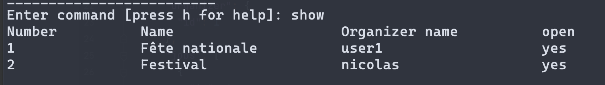

# SDR 2022 / Labo 1 - Programmation répartie

> Nicolas Crausaz & Maxime Scharwath


## Installation

Installez les dépendances du projet avec la commande :

`go get -d`

## Configuration

La configuration du serveur et du client sont séparées dans deux fichiers différents.

La configuration du serveur se trouve dans [`server.json`](./server.json):

```json
  "host": "localhost",    // IP / nom DNS du serveur
  "port": 9000,           // Port d'écoute du serveur
  "debug": false,         // Mode de debug de la concurence, ralenti les entrées en sections critique
  "showInfosLogs": false, // Active l'affichage des données brutes lors des communications
  "users": [...],         // Utilisateurs enregistrés
  "events": [...]         // Evénements enregistrés
```

La configuration du client se trouve dans [`client.json`](./client.json):

```json
{
  "srvHost": "localhost",  // IP / nom DNS du serveur
  "srvPort": 9000,         // Port d'écoute du serveur
  "showInfosLogs": false,  // Active l'affichage des données brutes lors des communications
}
```

## Utilisation

### Lancer le serveur (directement, ou via un exécutable)

> `go run server.go`
> ou
> `go build server.go && ./server`

Le serveur attendra des connexions sur le port TCP configuré dans `config/server.json`

### Lancer un client (directement, ou via un exécutable)

> `go run client.go`
> ou
> `go build client.go && ./client`

### Liste de commandes disponible

#### Créer une manifestation

> create

Puis saisir les informations demandées. Il est nécessaire de s'authentifier pour créer une manifestation.

#### Clôturer une manifestation

> close

Puis saisir les informations demandées.
Il est nécessaire de s'authentifier et d'être le créateur de la manifestation pour la clôturer.

#### Inscription d’un bénévole

> register

Puis saisir les informations demandées. Il est nécessaire de s'authentifier.
Il est possible d'être inscrit qu'à un seul poste par manifestation, l'inscription la plus récente sera conservée.

#### Liste des manifestations

> show

Affiche l'état de toutes les manifestations.



#### Informations d'une manifestation

> show `<numéro manifesation>`

Affiche les informations d'une manifestation


#### Répartition des postes pour une manifestation

> show `<numéro manifesation>` --resume

Affiche l'état des postes d'une manifestation.


## Tests

Pour exécuter les tests, lancez la commande :
> `go test ./tests/integration_test.go`

Pour effectuer des tests manuels sur la concurrence et sur le protocole, modifiez la configuration du serveur pour ralentir
les entrées en zones critiques :
> `"debug": false`


## Limitations

Il n'y a pas de persistance des données au-delà de l'exécution du serveur.
